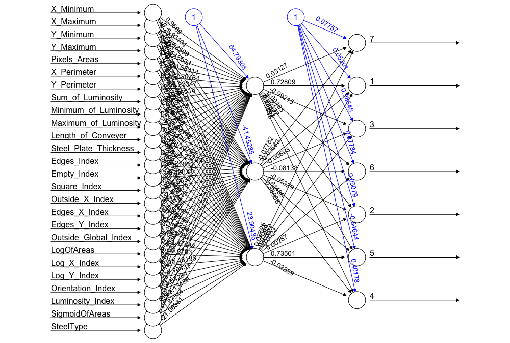

```{r setup, include=FALSE}
knitr::opts_chunk$set(echo = TRUE)
```

### I.  Project Description

In this project, we would like to utilize machine learning techniques to classify types of surface defects in stainless steel plates. There are seven types of defects in the dataset:  

* Pastry
* Z_Scratch
* K_Scatch
* Stains
* Dirtiness
* Bumps
* Other_Faults  

And there are 34 features in the dataset which are used as parameters in the model:    
X_Minimum, X_Maximum, Y_Minimum, Y_Maximum, Pixels_Areas, X_Perimeter, Y_Perimeter, SumofLuminosity, MinimumofLuminosity, MaximumofLuminosity, LengthofConveyer, TypeOfSteel_A300, TypeOfSteel_A400, SteelPlateThickness, Edges_Index, Empty_Index, Square_Index, OutsideXIndex, EdgesXIndex, EdgesYIndex, OutsideGlobalIndex, LogOfAreas, LogXIndex, LogYIndex, Orientation_Index, Luminosity_Index, SigmoidOfAreas

#### Dataset resource: [here](https://www.kaggle.com/uciml/faulty-steel-plates?fbclid=IwAR1_GKUHnj6D0haU8UuIj24jjeXzXtkwghQAI-y9y_FcXLrOnOIg3W1Kwd8)  


### II. Load data + Library
```{r, warning=FALSE, message=FALSE}
library(tidyverse, quietly = T)
library(naniar, quietly = T)
library(C50, quietly = T)
library(e1071, quietly = T) 
library(caret, quietly = T)
library(class, quietly = T)
library(gmodels, quietly = T)
library(neuralnet, quietly = T)
faults <- read.csv("faults_recode.csv")

```

### III. Data Cleaning
First, let's take a look at the data:
We can see that are total 1941 observations in the data, and total 36 variables, including the indicator for seven types of defects: `Pastry`, `Z_Scratch`, `K_Scatch`, `Stains`, `Dirtiness`, `Bumps`, `Other_Faults`. The variable `label` is the combined results for the above seven indicators.
```{r}
faults %>% glimpse()
```

Checking for missing values: 
```{r}
faults %>% miss_var_summary() #No NAs
#any(is.na(faults))
```
There are no missing values in this dataset. 


Now, let's take a look at the distribution of each defects: 
```{r}
table(faults$label)
ggplot(data = faults, aes(label)) +
  geom_bar()
```

Create another variable `label_num`, indicate numeric values for seven types of defects.
```{r}
faults$label_num = ifelse(faults$label =="Pastry", 1,
ifelse(faults$label == "Z_Scratch", 2,
ifelse(faults$label == "K_Scatch", 3,
ifelse(faults$label == "Stains", 4,
ifelse(faults$label == "Dirtiness", 5,
ifelse(faults$label == "Bumps", 6, 
ifelse(faults$label == "Other_Faults", 7, NA)))))))
```


Recoding of type of steel, type of steel is either "A300" (`TypeOfSteel_A300`) or "A400" (`TypeOfSteel_A400`), in here, we combine these two variables to an indicator `SteelType`, indicates 1 for A300, 0 for A400. 
```{r}
#Type of steel is merged into a single column and mase to factor
faults$SteelType<-ifelse(faults$TypeOfSteel_A300==1,1,0)
#faults$SteelType<-as.factor(faults$SteelType)
```

Select the variables used for training, note that `Pastry`, `Z_Scratch`, `K_Scatch`, `Stains`, `Dirtiness`, `Bumps`, `Other_Faults` are the seven types of defects and are combined in the variables `label`, which will be set as our training outcome. Therefore, we removed the seven types of detects in the training data.
```{r}
# select relevant variables
# outcome: sdata$label
new.faults = faults %>% dplyr::select(-c(Pastry, Z_Scratch, K_Scatch, Stains, Dirtiness, Bumps, Other_Faults, TypeOfSteel_A300, TypeOfSteel_A400))
new.faults$label = as.factor(new.faults$label)
new.faults$label_num = factor(new.faults$label_num)
```

`new.faults` is our final cleaned data that will be used for machine learning training.

### IV. Split training and testing set: ratio 7:3
training set: N = 1358   
testing set: N = 583
```{r}
# split train and test dataset
set.seed(40)
train_ind <- sample(seq_len(nrow(new.faults)), size = as.integer(dim(new.faults)[1]*0.7))

train <- new.faults[train_ind,]
test <- new.faults[-train_ind,]
```


### V. Model training and testing
#### Model 1: Logistic Regression

```{r}
#Logit model for Pastry Faults

faults_logit <- faults[c(1:11,14:26,36,35,28)]
faults_logit$label<- NULL
#faults_logit$Pastry<- as.factor(ifelse(faults_logit$Pastry==1,'Pastry','Not Pastry'))
faults_logit %>% glimpse()
fault_logit_model <- glm(Pastry~X_Minimum + X_Maximum + Y_Minimum + Y_Maximum +Pixels_Areas + X_Perimeter + Y_Perimeter + Sum_of_Luminosity + Minimum_of_Luminosity + Maximum_of_Luminosity + Length_of_Conveyer + Steel_Plate_Thickness + Edges_Index+ Square_Index + Edges_Y_Index + LogOfAreas, data = faults_logit, family = 'binomial')
summary(fault_logit_model)


```


#### Model 2: Support Vector Machine: 
##### 1. Linear Kernal
```{r}
# start training using linear kernal
system.time({
  svm.linear <- svm(formula = label ~ ., 
                 data = train %>% dplyr::select(-label_num), 
                 type = 'C-classification', 
                 kernel = 'linear') 
})

# predict test result
svm.linear.pred <- predict(svm.linear, newdata = test %>% dplyr::select(-label, label_num)) 

# confusion matrix
cm.svm.linear <- confusionMatrix(svm.linear.pred, as.factor(test[, "label"]))
accuracy.svm.linear <- round(as.numeric(cm.svm.linear$overall[1])*100, digits = 2)
pred.table.svm.linear <- cm.svm.linear$table
print(pred.table.svm.linear)
```

Compare to true test label: 
```{r}
# true test label
table(test$label)
```

Results: Accuracy of using SVM linear kernal is `r accuracy.svm.linear`%.

##### 2. Radial Kernal
```{r}
system.time({
  svm.radial <- svm(formula = label ~ ., 
                 data = train %>% dplyr::select(-label_num), 
                 type = 'C-classification', 
                 kernel = 'radial') 
})

# predict test result
svm.radial.pred <- predict(svm.radial, newdata = test %>% dplyr::select(-label, -label_num)) 

# confusion matrix
cm.svm.radial <- confusionMatrix(svm.radial.pred, as.factor(test[, "label"]))
accuracy.svm.radial <- round(as.numeric(cm.svm.radial$overall[1])*100, digits = 2)
pred.table.svm.radial <- cm.svm.radial$table
print(pred.table.svm.radial)
```

Compare to true test label: 
```{r}
# true test label
table(test$label)
```

Results: Accuracy of using SVM radial kernel is `r accuracy.svm.radial`%.

#### Model 3: k-Nearest-Neighbors (KNN) 
```{r}
# seperate the variables and labels for train and test dataset

train_label <- train[,"label"]
train_KNN <- train  %>% dplyr::select(-label, -label_num)
test_label <- test[,"label"]
test_KNN <- test %>% dplyr::select(-label, -label_num)


#do the z-Score Standardization for dataset
standardized.train_KNN <- scale(train_KNN)
standardized.test_KNN <- scale(test_KNN)

# find the best k-value
accuracy.rate = NULL
for(i in 1:20){
    KNN_pred_find = knn(train = standardized.train_KNN, test = standardized.test_KNN, cl = train_label, k=i)
    accuracy.rate[i] = 1-(mean(test_label != KNN_pred_find))
}
print(accuracy.rate)

# find the k with highest accuracy
best_k = which(accuracy.rate == max(accuracy.rate))
print(best_k)

# use the best k to train
system.time({
  KNN_pred <- knn(train = standardized.train_KNN, test = standardized.test_KNN, cl = train_label, k= best_k)
})

# Accuracy
# accuracy.knn = round(mean(test_label== KNN_pred)*100, digits = 2)

# confusion matrix
cm.knn <- confusionMatrix(KNN_pred, as.factor(test[, "label"]))
accuracy.knn <- round(as.numeric(cm.knn$overall[1])*100, digits = 2)
pred.table.knn <- cm.knn$table
print(pred.table.knn)

```

Compare to true test label: 
```{r}
# true test label
table(test$label)
```


We test different k from 1 to 20, and found that k = `r best_k` showed highest accuracy.
Results: Accuracy of using kNN with k = `r best_k` is `r accuracy.knn`%.

#### Model 4: Decision Tree
##### 1. Use default one number of boosting trial
```{r}
# build decision tree model 
system.time({
  decision.tree <- C5.0(train %>% dplyr::select(-label, -label_num), train$label)
})
#str(decision.tree)
#plot(decision.tree)
print(decision.tree)

# predict fault types 
ds.pred <- predict(decision.tree,test %>% dplyr::select(-label, -label_num))
# table(ds.pred)

#cross tabulation of predicted vs actual values 
CrossTable(test$label, ds.pred, prop.chisq = FALSE, prop.c = FALSE, prop.r = FALSE,
           dnn = c('actual faults', 'predicted faults'))

# confusion matrix
cm.ds.tree <- confusionMatrix(ds.pred, as.factor(test[, "label"]))
accuracy.cm.ds.tree <- round(as.numeric(cm.ds.tree$overall[1])*100, digits = 2)
pred.table.ds.tree <- cm.ds.tree$table
print(pred.table.ds.tree)

```

Compare to true test label: 
```{r}
# true test label
table(test$label)
```

Results: Accuracy of using decision tree with one boosting trial is `r accuracy.cm.ds.tree`%.


##### 2. Setting boosting trials to 12
```{r}
#improve accuracy or reliability (give cost matrix dpending on if false positive or false negative is better)
system.time({
  ds.tree.boost12 <- C5.0(train %>% dplyr::select(-label, -label_num), train$label, trials = 12)
})
print(ds.tree.boost12)

# summary(ds.tree.boost12)
ds.tree.boost12.pred <- predict(ds.tree.boost12, test %>% dplyr::select(-label, -label_num))

CrossTable(test$label, ds.tree.boost12.pred, prop.chisq = FALSE, prop.c = FALSE, prop.r = FALSE, dnn = c('actual label', 'label predictions'))

cm.ds.tree.12 <- confusionMatrix(ds.tree.boost12.pred, as.factor(test[, "label"]))
accuracy.cm.ds.tree.12 <- round(as.numeric(cm.ds.tree.12$overall[1])*100, digits = 2)
pred.table.ds.tree.12 <- cm.ds.tree.12$table
print(pred.table.ds.tree.12)
```

Compare to true test label: 
```{r}
# true test label
table(test$label)
```

Results: Accuracy of using decision tree with 12 boosting trials is `r accuracy.cm.ds.tree.12`%.


#### Model 5: Artifical Neural Network (ANN) 

```{r, warning=FALSE}
# change the data type for label to numeric type
#train_ANN <- train
#train_ANN <- train_ANN[,-26]
#test_ANN <- test_ANN[,-26]

#do the z-Score Standardization for dataset
standardized.train_ANN <- scale(train %>% dplyr::select(-c(label, label_num)))
standardized.test_ANN <- scale(test %>% dplyr::select(-c(label, label_num)))

# merge label back to train/test data
standardized.train_ANN <- cbind(standardized.train_ANN, train$label_num)
colnames(standardized.train_ANN)[dim(standardized.train_ANN)[2]] <- "label_num"
standardized.test_ANN <- cbind(standardized.test_ANN, test$label_num)
colnames(standardized.test_ANN)[dim(standardized.test_ANN)[2]] <- "label_num"

# ANN modeling
system.time({
  ANN_model <- neuralnet(formula = as.factor(label_num) ~ .,
                       data = standardized.train_ANN, 
                       rep = 4, # number of repetitions for the neural network's training.
                       hidden = 3)  
})

# plot(ANN_model)

# obtain model results
test_results <- predict(ANN_model, standardized.test_ANN[,1:26])
# obtain predicted 
#predicted_label <- test_results$net.result
#table(standardized.test_ANN[,"label_num"], apply(test_results, 1, which.max))

# examine the correlation between predicted and actual values
#cor(predicted_label, standardized.test_ANN[,"label_num"])

cm.ann <- confusionMatrix(as.factor(apply(test_results, 1, which.max)), as.factor(test[, "label_num"]))

accuracy.cm.ann <- round(as.numeric(cm.ann$overall[1])*100, digits = 2)
pred.table.ann <- cm.ann$table
print(pred.table.ann)
```

Compare to true test label: 
```{r}
# true test label
table(test$label)
```

Plotting the ANN model: 


Results: Accuracy of using ANN 1 hidden layers with 5 nodes is `r accuracy.cm.ann`%.

### VI. Comparing Accuracy
The below tables show the accuracy of the above five methods:
```{r}

```


### VII. Application


