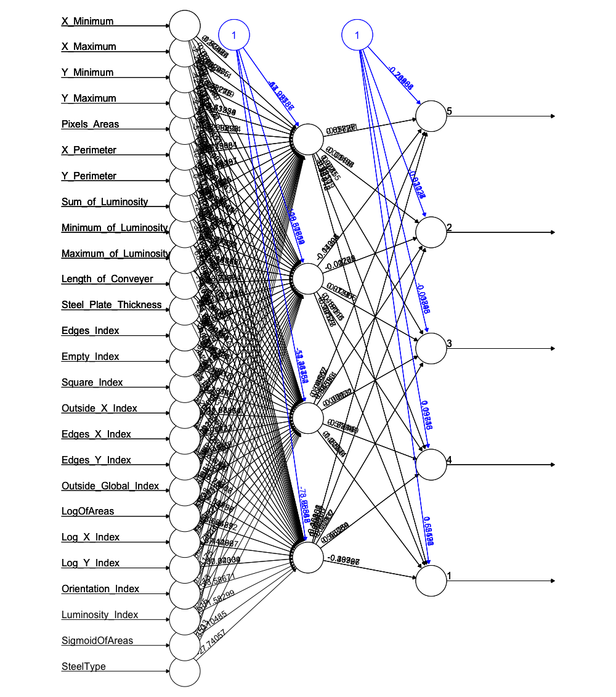

```{r setup, include=FALSE}
knitr::opts_chunk$set(echo = TRUE)
```

### I.  Project Description

In this project, we would like to utilize machine learning techniques to classify types of surface defects in stainless steel plates. There are seven types of defects in the dataset:  

* Pastry
* Z_Scratch
* K_Scatch
* Stains
* Dirtiness
* Bumps
* Other_Faults  

And there are 34 features in the dataset which are used as parameters in the model:    
X_Minimum, X_Maximum, Y_Minimum, Y_Maximum, Pixels_Areas, X_Perimeter, Y_Perimeter, SumofLuminosity, MinimumofLuminosity, MaximumofLuminosity, LengthofConveyer, TypeOfSteel_A300, TypeOfSteel_A400, SteelPlateThickness, Edges_Index, Empty_Index, Square_Index, OutsideXIndex, EdgesXIndex, EdgesYIndex, OutsideGlobalIndex, LogOfAreas, LogXIndex, LogYIndex, Orientation_Index, Luminosity_Index, SigmoidOfAreas

#### Dataset resource: [here](https://www.kaggle.com/uciml/faulty-steel-plates?fbclid=IwAR1_GKUHnj6D0haU8UuIj24jjeXzXtkwghQAI-y9y_FcXLrOnOIg3W1Kwd8)  


### II. Load data + Library
```{r, warning=FALSE, message=FALSE}
library(tidyverse, quietly = T)
library(naniar, quietly = T)
library(C50, quietly = T)
library(e1071, quietly = T) 
library(caret, quietly = T)
library(class, quietly = T)
library(gmodels, quietly = T)
library(neuralnet, quietly = T)
library(nnet, quietly = T)
library(stargazer, quietly = T)
library(knitr, quietly = T)
faults <- read.csv("faults_recode.csv")

```

### III. Data Cleaning and Exploration
1. First, let's take a look at the data:
We can see that are total 1941 observations in the data, and total 36 variables, including the indicator for seven types of defects: `Pastry`, `Z_Scratch`, `K_Scatch`, `Stains`, `Dirtiness`, `Bumps`, `Other_Faults`. The variable `label` is the combined results for the above seven indicators.
```{r}
faults %>% glimpse()
```

2. Checking for missing values: 
```{r}
faults %>% miss_var_summary() #No NAs
#any(is.na(faults))
```
There are no missing values in this dataset. 


3. Now, let's take a look at the distribution of each defects, we can see that most defects fall in `Bumps`, `K_Scatch` and `Other_Faults`.
```{r}
table(faults$label)
ggplot(data = faults, aes(label, fill = label)) +
  geom_bar() +
  ggtitle("Distribution of seven defects (N = 1941)")
```

4. Create another variable `relabel` indicates the combined version of the seven defects, we combined `Stains` and `Dirtiness` to `Other_Faults`, since `Stains` and `Dirtiness` showed the least freqeuncies among the seven defects. After combinding, we reached to five types of defects: `Pastry`, `Z_Scratch`, `K_Scatch`, `Bumps`, `Other_Faults`.
```{r}
faults$relabel = ifelse(faults$label == "Pastry", 1,
                        ifelse(faults$label == "Z_Scratch", 2,
                               ifelse(faults$label == "K_Scatch", 3,
                                      ifelse(faults$label == "Bumps", 4,
                                             ifelse(faults$label == "Stains", 5,
                                                    ifelse(faults$label == "Dirtiness",5, 
                                                           ifelse(faults$label == "Other_Faults", 5, NA)))))))
faults$relabel = factor(faults$relabel, levels = c(1, 2, 3, 4, 5), labels = c("Pastry", "Z_Scratch", "K_Scatch", "Bumps", "Other_Faults"))

table(faults$relabel)

ggplot(data = faults, aes(relabel, fill = relabel)) +
  geom_bar() +
  ggtitle("Distribution of five defects (N = 1941)")
```

5. Below are the box-whisker plots showing distribution of some of our training parameters:
```{r, out.width=c('50%', '50%')}
boxplot(faults$X_Minimum, faults$X_Maximum,
        horizontal = TRUE,
        main = "Boxplot for X_Minimum, X_Maximum",
        names = c("X_Min", "X_Max"),
        col = c("orange","green"),
        las = 2,
        notch = TRUE)
boxplot(faults$Y_Minimum, faults$Y_Maximum,
        horizontal = TRUE,
        main = "Boxplot for Y_Minimum, Y_Maximum",
        names = c("Y_Min", "Y_Max"),
        col = c("orange","green"),
        las = 2,
        notch = TRUE)
boxplot(faults$Minimum_of_Luminosity, faults$Maximum_of_Luminosity,
        horizontal = TRUE,
        main = "Boxplot for Luminosity",
        names = c("Min", "Max"),
        col = c("orange","green"),
        las = 2,
        notch = TRUE)
boxplot(faults$Edges_Index, faults$Empty_Index, faults$Square_Index, 
        horizontal = TRUE,
        main = "Boxplot for Indicies",
        at = c(1,3,5),
        names = c("Edges", "Empty", "Square"),
        col = c("orange","green", "purple"),
        las = 3,
        notch = TRUE)
```


6. Recoding of type of steel, type of steel is either "A300" (`TypeOfSteel_A300`) or "A400" (`TypeOfSteel_A400`), in here, we combine these two variables to an indicator `SteelType`, indicates 1 for A300, 0 for A400. 
```{r}
#Type of steel is merged into a single column and mase to factor
faults$SteelType<-ifelse(faults$TypeOfSteel_A300==1,1,0)
#faults$SteelType<-as.factor(faults$SteelType)
```

7. Select the variables used for training, note that `Pastry`, `Z_Scratch`, `K_Scatch`, `Stains`, `Dirtiness`, `Bumps`, `Other_Faults` are the indicators for seven types of defects, which are now combined into `relabel`. `Relabel` will be set as our training outcome. 
```{r}
# select relevant variables
# outcome: sdata$label
new.faults = faults %>% dplyr::select(-c(Pastry, Z_Scratch, K_Scatch, Stains, Dirtiness, Bumps, Other_Faults, TypeOfSteel_A300, TypeOfSteel_A400, label))
```

`new.faults` is our final cleaned data that will be used for machine learning training.

### IV. Split training and testing set: ratio 7:3
training set: N = 1358   
testing set: N = 583
```{r}
# split train and test dataset
set.seed(40)
train_ind <- sample(seq_len(nrow(new.faults)), size = as.integer(dim(new.faults)[1]*0.7))

train <- new.faults[train_ind,]
test <- new.faults[-train_ind,]
```

Lets take a look at the distribution of the seven defects in training and testing dataset:
```{r, out.width=c('50%', '50%')}
ggplot(data = train, aes(relabel, fill = relabel)) +
  geom_bar() +
  ggtitle("Distribution of five defects in training set (N = 1358)")

ggplot(data = test, aes(relabel, fill = relabel)) +
  geom_bar() +
  ggtitle("Distribution of five defects in testing set (N = 583)")
```


### V. Model training and testing
#### Model 1: Multinomial Logistic Regression
Since we have seven types of detects as our outcome, we use multinomial logistic regression instead binomial logistic regression to train our model.
```{r}
#faults %>% group_by(label) %>% summarise(n=n(),prop=n/nrow(faults))
#faults_logit <- faults[c(1:11,14:27,36,35)]
#set.seed(40)
#train_set =sample(seq_len(nrow(faults_logit)), size = as.integer(dim(faults_logit)[1]*0.7)) 
#fault_train = faults_logit[train_set,]
#fault_test = faults_logit[-train_set,]

#Proportion of faults in train and test set
#fault_train %>% group_by(label) %>% summarise(n=n(),prop=n/nrow(fault_train))
#fault_test %>% group_by(label) %>% summarise(n=n(),prop=n/nrow(fault_test))

# NNET-> Multinom
system.time({
  multinom_1<- multinom(relabel ~.,data= train)
})
# summary(multinom_1)

# to get pvalues
stargazer(multinom_1, type="text", out="multi1.txt")

# predict test result
multinom_1_pred<-predict(multinom_1, test %>% select(-c(relabel)))
# CrossTable(multinom_1_pred, test$label)
#Accuracy
# sum(multinom_1_pred==fault_test$label)/nrow(fault_test)*100

# confusion matrix
cm.multinom <- confusionMatrix(multinom_1_pred, as.factor(test[, "relabel"]))
accuracy.multinom <- round(as.numeric(cm.multinom$overall[1])*100, digits = 2)
kappa.multinom <- round(as.numeric(cm.multinom$overall[2])*100, digits = 2)
pred.table.multinom <- cm.multinom$table
print(pred.table.multinom)
```

Results: Accuracy of using multinomial logistic regression is `r accuracy.multinom`%. Kappa statistics shows `r kappa.multinom`%. 


#### Model 2: Support Vector Machine: 
##### 1. Linear Kernal
```{r}
# start training using linear kernal
system.time({
  svm.linear <- svm(formula = relabel ~ ., 
                 data = train, 
                 type = 'C-classification', 
                 kernel = 'linear') 
})

# predict test result
svm.linear.pred <- predict(svm.linear, newdata = test %>% dplyr::select(-relabel)) 

# confusion matrix
cm.svm.linear <- confusionMatrix(svm.linear.pred, as.factor(test[, "relabel"]))
accuracy.svm.linear <- round(as.numeric(cm.svm.linear$overall[1])*100, digits = 2)
kappa.svm.linear <- round(as.numeric(cm.svm.linear$overall[2])*100, digits = 2)
pred.table.svm.linear <- cm.svm.linear$table
print(pred.table.svm.linear)
```


Results: Accuracy of using SVM linear kernal is `r accuracy.svm.linear`%. Kappa statistics shows `r kappa.svm.linear`%.

##### 2. Radial Kernal
```{r}
system.time({
  svm.radial <- svm(formula = relabel ~ ., 
                 data = train, 
                 type = 'C-classification', 
                 kernel = 'radial') 
})

# predict test result
svm.radial.pred <- predict(svm.radial, newdata = test %>% dplyr::select(-relabel)) 

# confusion matrix
cm.svm.radial <- confusionMatrix(svm.radial.pred, as.factor(test[, "relabel"]))
accuracy.svm.radial <- round(as.numeric(cm.svm.radial$overall[1])*100, digits = 2)
kappa.svm.radial <- round(as.numeric(cm.svm.radial$overall[2])*100, digits = 2)
pred.table.svm.radial <- cm.svm.radial$table
print(pred.table.svm.radial)
```

Results: Accuracy of using SVM radial kernel is `r accuracy.svm.radial`%. Kappa statistics shows `r kappa.svm.radial`%.

#### Model 3: k-Nearest-Neighbors (KNN) 

##### 1. Find the best k
We test k from 1 to 20, and find the k with the highest accuracy to perform KNN:
```{r}
# seperate the variables and labels for train and test dataset

train_label <- train[,"relabel"]
train_KNN <- train %>% select(-relabel)
test_label <- test[,"relabel"]
test_KNN <- test %>% select(-relabel)


#do the z-Score Standardization for dataset
standardized.train_KNN <- scale(train_KNN)
standardized.test_KNN <- scale(test_KNN)

# find the best k-value
accuracy.rate = NULL
for(i in 1:20){
    KNN_pred_find = knn(train = standardized.train_KNN, test = standardized.test_KNN, cl = train_label, k=i)
    accuracy.rate[i] = 1-(mean(test_label != KNN_pred_find))
}
print(accuracy.rate)

# find the k with highest accuracy
best_k = which(accuracy.rate == max(accuracy.rate))
print(best_k)

```

Therefore, the best k among 1 to 20 is `r best_k`, which shows highest accuracy.       


##### 2. Build the model with best k: 
```{r}
# use the best k to train
system.time({
  KNN_pred <- knn(train = standardized.train_KNN, test = standardized.test_KNN, cl = train_label, k= best_k)
})

# Accuracy
# accuracy.knn = round(mean(test_label== KNN_pred)*100, digits = 2)

# confusion matrix
cm.knn <- confusionMatrix(KNN_pred, as.factor(test[, "relabel"]))
accuracy.knn <- round(as.numeric(cm.knn$overall[1])*100, digits = 2)
kappa.knn <- round(as.numeric(cm.knn$overall[2])*100, digits = 2)
pred.table.knn <- cm.knn$table
print(pred.table.knn)
```


Results: Accuracy of using kNN with k = `r best_k` shows `r accuracy.knn`%. Kappa statistics shows `r kappa.knn`%.

#### Model 4: Decision Tree
##### 1. Find the best boosting trials: 
We test boosting trial from 1 to 20, and find the boosting trials with the highest accuracy to perform decision tree:
```{r}
# find the best boosting trials
accuracy.rate = NULL
for(i in 1:20){
    ds.tree.find <- C5.0(train %>% select(-relabel) , train$relabel, trials = i)
    ds.find.pred <- predict(ds.tree.find, test %>% select(-relabel))
    cm.ds.tree.find <- confusionMatrix(ds.find.pred, as.factor(test[, "relabel"]))
    accuracy.cm.find <- round(as.numeric(cm.ds.tree.find$overall[1])*100, digits = 2)
    accuracy.rate[i] = accuracy.cm.find
}
print(accuracy.rate)

# find the best boosting trial with highest accuracy
best_t = min(which(accuracy.rate == max(accuracy.rate)))
print(best_t)

```

Therefore, the best boosting trial is `r best_t`, which shows highest accuracy.


##### 2. Build the model with best boosting trials: 
Now, we trained the model with the best boosting trials found in the previous step.
```{r}
#improve accuracy or reliability (give cost matrix dpending on if false positive or false negative is better)
system.time({
  ds.tree.boost <- C5.0(train %>% dplyr::select(-relabel), train$relabel, trials = best_t)
})
print(ds.tree.boost)
# summary(ds.tree.boost)
#CrossTable(test$label, ds.tree.boost12.pred, prop.chisq = FALSE, prop.c = FALSE, prop.r = FALSE, dnn = c('actual label', 'label predictions'))

ds.tree.boost.pred <- predict(ds.tree.boost, test %>% select(-relabel))
cm.ds.tree <- confusionMatrix(ds.tree.boost.pred, as.factor(test[, "relabel"]))
accuracy.cm.ds.tree <- round(as.numeric(cm.ds.tree$overall[1])*100, digits = 2)
kappa.cm.ds.tree <- round(as.numeric(cm.ds.tree$overall[2])*100, digits = 2)
pred.table.ds.tree <- cm.ds.tree$table
print(pred.table.ds.tree)
```

Result for summary of the decision tree model:     
Attribute usage:    

	100.00%	Length_of_Conveyer   
	100.00%	Steel_Plate_Thickness   
	100.00%	Outside_X_Index   
	100.00%	LogOfAreas   
	100.00%	Log_X_Index   
	 99.93%	Orientation_Index   
	 99.26%	Luminosity_Index   
	 99.19%	Maximum_of_Luminosity   
	 98.38%	Minimum_of_Luminosity   
	 97.94%	X_Maximum   
	 97.79%	Log_Y_Index   
	 97.20%	SteelType   
	 96.24%	Edges_Index   
	 94.04%	Y_Minimum   
	 93.96%	Empty_Index   
	 91.97%	X_Minimum   
	 85.35%	Square_Index   
	 83.36%	Edges_Y_Index   
	 82.62%	Sum_of_Luminosity   
	 81.96%	Edges_X_Index   
	 81.15%	Pixels_Areas   
	 79.01%	X_Perimeter   
	 75.33%	Y_Perimeter   
	 54.42%	Y_Maximum   
	 42.19%	SigmoidOfAreas   
	 40.65%	Outside_Global_Index        

Results: Accuracy of using decision tree with `r best_t` boosting trials is `r accuracy.cm.ds.tree`%. Kappa statistics shows `r kappa.cm.ds.tree`%.


#### Model 5: Artifical Neural Network (ANN) 

```{r, warning=FALSE}
# change the data type for label to numeric type
#train_ANN <- train
#train_ANN <- train_ANN[,-26]
#test_ANN <- test_ANN[,-26]

#do the z-Score Standardization for dataset
standardized.train_ANN <- scale(train %>% dplyr::select(-relabel))
standardized.test_ANN <- scale(test %>% dplyr::select(-relabel))

# merge label back to train/test data
standardized.train_ANN <- as.data.frame(cbind(standardized.train_ANN, train$relabel))
colnames(standardized.train_ANN)[dim(standardized.train_ANN)[2]] <- "relabel"
standardized.test_ANN <- as.data.frame(cbind(standardized.test_ANN, test$relabel))
colnames(standardized.test_ANN)[dim(standardized.test_ANN)[2]] <- "relabel"

# ANN modeling
system.time({
  ANN_model <- neuralnet(formula = as.factor(relabel) ~ .,
                       data = standardized.train_ANN, 
                       hidden = 4)  
})

# plot(ANN_model)

# obtain model results
test_results <- predict(ANN_model, standardized.test_ANN %>% select(-relabel))
# obtain predicted 
#predicted_label <- test_results$net.result
#table(standardized.test_ANN[,"label_num"], apply(test_results, 1, which.max))

# examine the correlation between predicted and actual values
#cor(predicted_label, standardized.test_ANN[,"label_num"])

cm.ann <- confusionMatrix(as.factor(apply(test_results, 1, which.max)), as.factor(standardized.test_ANN[, "relabel"]))

accuracy.cm.ann <- round(as.numeric(cm.ann$overall[1])*100, digits = 2)
kappa.cm.ann <- round(as.numeric(cm.ann$overall[2])*100, digits = 2)
pred.table.ann <- cm.ann$table
print(pred.table.ann)
```


Plotting the ANN model: 


Results: Accuracy of using ANN 1 hidden layers with 4 nodes is `r accuracy.cm.ann`%. Kappa statistics shows `r kappa.cm.ann`%. 

### VI. Comparing Accuracy
The below tables show the accuracy of the above five methods:
```{r, echo = FALSE}
result.table = data.frame(Model = c("Multinomial LR", "SVM radial", paste0("KNN: k = ", best_k), paste0("Decision tree: trial = ", best_t), "ANN with 3 nodes"),
                          Accuracy = c(accuracy.multinom, accuracy.svm.radial, accuracy.knn,  accuracy.cm.ds.tree, accuracy.cm.ann),
                          kappa = c(kappa.multinom, kappa.svm.radial, kappa.knn, kappa.cm.ds.tree, kappa.cm.ann))
kable(result.table)
```


### VII. Application & Conclusion
          
Our dataset and model together answer the question, what kind of defect does a steel plate has, which is simple, but has a lot of business implications. Steel is mostly used in construction, "accounting for more than 50% of world steel demand". [2] To reduce risk for safety, environmental impact, and economic loss, fault detection becomes really important in the manufacutring processes. In the manufacturing industry this is called "Fault Diagnosis (FD)" [1] and "has a major importance to enhance the quality of manufacutring and to lessen the cost of product testing." [1] For this project, the team developed several ML models that would help detect the types of faults as early as possible and prevent serious issues from occurring.       
   
The seven types of steel faults that the team analyzed in this dataset are considered the most common defects in steel plates. The team developed five FD models including logistic regression, ANN, KNN, SVM, and decision tree (with and without boosting). The team then compared these using accuracy generated through testing with our test dataset. Among these five models, the decision tree model with `r best_t` boosting trials demonstrates the most accuracy of (`r accuracy.cm.ds.tree`%), outperforming all other models all of which showed accuracy of around 70%.  Looking at the summary of attribute usage for our decision tree model, we also find that the top four fault characteristics of a steel plate with 100% attribute usage are thickness of steel plate, outside x index, log x index, and log of area.     

The decision tree model with boosting trials the team developed and selected to be the best among the models tested can provide useful business applications for manufacturers. This model will help the faults to be detected and identified as early as possible to help the manufacturers employ proper precautionary measures early on. In addition, "during manufacturing downtimes, most of the time spent is on localization of the fault rather than carrying out the actual remediation, as fault diagnosis is the most challenging phase of machine repairs." [3] The predictions of our model generated through machine learning techniques will be able to provide timely diagnosis for faults and help keep the manufacturers stay competitive by reducing machine downtimes, which in turn increase production speed and lower costs.        
```{r, echo = FALSE}
att.usage <- data.frame(Variables = c("Length_of_Conveyer", "Steel_Plate_Thickness", "Outside_X_Index", "LogOfAreas", "Log_X_Index", "Orientation_Index", "Luminosity_Index", "Maximum_of_Luminosity", "Minimum_of_Luminosity", "X_Maximum", "Log_Y_Index", "SteelType", "Edges_Index", "Y_Minimum", "Empty_Index", "X_Minimum", "Square_Index", "Edges_Y_Index", "Sum_of_Luminosity", "Edges_X_Index", "Pixels_Areas", "X_Perimeter", "Y_Perimeter", "Y_Maximum"),
                                      Attribute_usage = c("100%","100%","100%","100%","100%", "99.93%", "99.26%", "99.19%", "98.38%", "97.94%", "97.79%", "97.20%", "96.24%", "94.04%", "93.96%", "91.97%", "85.35%", "83.36%", "82.62%", "81.96%", "81.15%", "79.01%", "75.33%", "54.42%"))
kable(att.usage)
```

            
### VIII. Reference
[1] https://www.researchgate.net/publication/265124971_Steel_Plates_Faults_Diagnosis_with_Data_Mining_Models   
[2] https://www.worldsteel.org/steel-by-topic/steel-markets/buildings-and-infrastructure.html   
[3] https://tsapps.nist.gov/publication/get_pdf.cfm?pub_id=923309    

